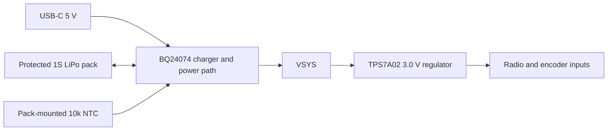

# TurnCount

TurnCount is a proposed rechargeable rotary counter that mounts magnetically to a phone. Turning the dial updates a signed count in a companion iOS or Android app over Bluetooth Low Energy (BLE).

**Status:** the repository implements a 48 mm round, two-layer PCB prototype with a left-side battery-lead notch, USB-C charging, a regulated radio supply, and a low-profile SMD encoder. A bottom-side space allocation is provided for an external LiPo pack beneath the encoder. A [print-and-fit enclosure prototype](mechanical/README.md) now includes the knob and magnetic base; the exact battery SKU, firmware and apps are not yet implemented. This is a design review prototype, not a fabrication release.

## Schematic sheets

The schematic viewer has three selectable, compact sheets: [Power](docs/schematics/power.svg) (USB-C, charger, battery connector and 3 V regulator), [Inputs](docs/schematics/inputs.svg) (encoder and A/B/push filters), and [Radio](docs/schematics/radio.svg) (BLE module, debug LED and programming pads). Use the **Sheet** menu in the Schematic view to switch between them. The SVGs can be zoomed for component pin details.

The encoder nets before the series resistors are labeled `ENC_A_RAW`, `ENC_B_RAW` and `ENC_SW_RAW`; the filtered signals to the radio are `ENC_A`, `ENC_B` and `ENC_SW`.

## Selected components

| Function | Part | JLCPCB code |
| --- | --- | --- |
| Rotary encoder with downward push | [G-Switch GT-EVA01AA-L1](https://www.lcsc.com/product-detail/C17702124.html) | C17702124 |
| USB-C receptacle, power only | [TYPE-C-31-M-12](https://www.lcsc.com/product-detail/C165948.html) | C165948 |
| Charger with power-path management | [TI BQ24074RGTR](https://www.lcsc.com/product-detail/C54313.html) | C54313 |
| Low-power 3.0 V regulator | [TI TPS7A0230PDBVR](https://www.lcsc.com/product-detail/C3747031.html) | C3747031 |
| Three-position pack/NTC connector | [JST S3B-PH-SM4-TB(LF)(SN)](https://www.lcsc.com/product-detail/C265101.html) | C265101 |
| Charger input bypass, 1 µF / 50 V | Samsung CL10A105KB8NNNC | C15849 |
| Battery, system and regulator bypass, 10 µF / 25 V | Samsung CL21A106KAYNNNE | C15850 |
| Bluetooth module | Raytac MDBT42Q-512KV2 (nRF52832) | C2828282 |
| Debug indicator | KENTO KT-0603R red LED, 0603 | C2286 |

Stock is indicative and must be checked when ordering. The encoder, USB-C receptacle, charger, regulator, pack connector and radio module were generated using `tsci import <code> --jlcpcb --use-exact-footprint`, **without `--download`**. Their remote OBJ/STEP model references come from the selected JLCPCB/EasyEDA entries. The separate enclosure prototype adds a printable knob; no substitute encoder or battery model has been added.

The imported pack connector's two mechanical solder tabs are represented as separate ground pads; the three electrical contacts are unchanged. Its aliases identify the intended harness wiring, not a universal battery connector pinout.

## Rechargeable supply



- **USB-C:** each CC pin has its own 5.1 kΩ pull-down. VBUS contacts feed `USB_5V`; all ground and shell contacts are grounded. D+/D− and SBU contacts are unused; there is no USB data interface or PD negotiation.
- **Charge control:** EN1 and EN2 are grounded, selecting TI's USB100 input-current limit. R10 = 8.66 kΩ requests approximately 103 mA charge current, but the 100 mA input limit and system load reduce the current actually available to the battery. R11 = 3.09 kΩ satisfies the required ILIM programming connection; resistor-controlled mode is not selected. CE is grounded to enable charging.
- **Temperature and timers:** TS connects to the pack's temperature-sensor lead. The pack must provide a charger-compatible 10 kΩ NTC to pack ground; an open TS connection inhibits charging. TMR and ITERM are intentionally unconnected to select TI's default active safety timers and termination threshold. Do not replace temperature sensing with a fixed resistor for the enclosed product.
- **Power path:** both BAT pins connect to `VBAT`, and both OUT pins connect to `VSYS`. System loading is separated from charge termination measurement. The device can operate from USB while charging or without a pack.
- **Radio voltage:** the regulator sits between `VSYS` and `V3V0`. A charged pack can reach 4.2 V, and BQ24074 OUT is approximately 4.4 V on USB. Neither rail directly feeds the radio. The regulator supplies nominally 3.0 V while sufficient headroom is available; its output can fall near battery depletion. Its NC pin remains open.
- **Status:** CHG and PGOOD have 100 kΩ pull-ups to `V3V0` and exposed test pads. Firmware access to these status signals has not been implemented.
- **Capacitors:** the USB input uses 1 µF; BAT, VSYS and the regulator output each use 10 µF, with selected JLCPCB part codes above. Verify effective capacitance after DC bias and tolerance against the TI minimum requirements before fabrication.

References: [BQ24074 datasheet](https://www.ti.com/lit/ds/symlink/bq24074.pdf), [TPS7A02 datasheet](https://www.ti.com/lit/ds/symlink/tps7a02.pdf).

### Battery contract and placement

The battery is an **external wired pack**, not a soldered coin cell or a selected purchasable SKU. The previous CR2032 holder is removed. The PCB allocation is **20 × 30 mm**, centered beneath the encoder, with a **3 mm cell-thickness target**. The enclosure prototype has a larger pocket for fit testing; neither allocation confirms that a specific protected pack fits.

Select a conventional **1S, 3.7 V nominal / 4.2 V full-charge LiPo pack**, with approximately **200 mAh target capacity**, rated for the charger's worst-case current, integral overcharge/over-discharge/short-circuit protection, and a compatible pack-mounted NTC. Pack protection, sensor wiring, connector polarity and charging-temperature limits must be verified against its datasheet. A 4.35 V high-voltage cell is not the intended battery.

| J2 electrical contact | Intended harness signal |
| --- | --- |
| 1 | Protected pack positive, `VBAT` |
| 2 | Protected pack negative, `GND` |
| 3 | NTC sensor, referenced to pack negative |

J2 is on the top, set inward from the left-side **6 mm wide × about 5.8 mm deep** PCB edge notch ([board preview](docs/pcb-battery-lead-notch.png)). The notch opens into the tray's lead trench so the three pack wires can pass below the PCB toward the central battery pocket. The harness bend radius and strain relief still need a physical fit test. No populated components or USB through-hole anchors occupy the reserved bottom rectangle. Add a suitable insulating mounting layer and verify pouch swelling, connector clearance and encoder locating-peg tolerances on the mechanical assembly. PCB thickness remains 1.6 mm; the prototype body is 18.8 mm high before the rotating cap.

## Encoder and mechanical direction

The [GT-EVA01AA-L1 drawing](https://datasheet.lcsc.com/datasheet/pdf/d558dce12d76d23321eaeb216a98bcc8.pdf?productCode=C17702124) specifies a **4.8 × 3.9 × 3.5 mm** SMD encoder body with a square shaft socket and downward push switch. This replaces the ALPS part with a 24.5 mm actuator height. The [printed cap prototype](mechanical/README.md) uses a metal drive pin; 3.5 mm describes the encoder body, not the final knob or enclosure height.

The imported footprint is shifted relative to the board origin so its **shaft axis remains at (0, 0)**. The two locating-hole centers are 1.4 mm below the shaft axis in the manufacturer's drawing. The exact imported land pattern and remote model are retained.

The encoder has **12 pulses and 12 detents per revolution**. A four-edge decoder therefore expects **48 legal quadrature transitions per turn**, with direction, detent alignment and bounce handling verified on hardware. A GPIO edge alone is not a step. A/B common and push D are grounded; push E feeds the switch input. The PCB includes 1 kΩ series resistors, 100 kΩ pull-ups and 1 nF capacitors on A, B and push.

### Contact-current qualification remains open

The new encoder drawing gives a **50 mA / 12 V rating**, but **does not specify a minimum reliable contact current or voltage**. Those are maximum/load ratings, not evidence that 20–30 µA sensing is qualified. The previous ALPS 1 mA minimum is no longer the selected part's specification, but low-current reliability still needs confirmation from G-Switch or suitable life/environment testing. A rechargeable battery alone does not resolve this question. Do not change to continuous strong pull-ups without evaluating their effect on run time.

## Radio and programming

The module is placed near the right edge with a keepout on both copper layers extending from its antenna toward the edge. The battery allocation ends before that region. Confirm antenna clearance against the exact module reference design, including the battery, magnets, phone and enclosure.

GPIO assignments remain P0.11 for A, P0.12 for B, P0.13 for push and P0.21 for reset. Test pads expose the regulated supply, ground, SWD, reset, A/B, battery, system supply, USB input and charger status. The fixture must not drive voltage into `VBAT`; avoid contention with USB or battery power when using an externally powered debug fixture.

`LED1` is a GPIO-controlled debug indicator on module pin 28 (`P0.14`). `R14` (1 kΩ) limits current from that pin to the red LED anode; the cathode is grounded. Driving P0.14 high turns it on. Keep it off during sleep and use brief pulses for diagnostics. The LED is on the top PCB face for bench debugging; the printed enclosure currently has no dedicated light window, so assembled visibility needs a fit test or a light pipe.

The Raytac module now uses the exact JLCPCB/EasyEDA import for [C2828282](https://jlcpcb.com/partdetail/Raytac-MDBT42Q512K/C2828282), including its remote 3D model. The generated symbol lacked the GPIO and reset names used by this design, so those pin aliases were completed in the local import against [Raytac's pin assignment](https://www.raytac.com/upload/download_files/38a8a4a0aff945d8484507d60058109b.pdf). Confirm model geometry against the exact 512KV2 module. Check stock and assembly availability when ordering.

## Firmware and app proposal

- Full-turn mode adds or subtracts one per complete revolution; reversals cancel partial progress. Step mode counts validated detents.
- A long dial press enters pairing; reset is an explicit app action.
- Firmware retains a signed cumulative total while disconnected and sends authoritative absolute state after reconnect. Duplicate BLE notifications must not double-count.
- A wear-managed flash journal checkpoints persistent state; sudden power removal can lose activity since the last checkpoint.
- The proposed BLE contract includes State (read/notify), Control (write with response), Battery and Device Information services. UUIDs and encoding remain to be defined.
- Phone-wide overlays and generic media/camera/HID controls are outside V1. Magnetic mounting does not imply Qi2 certification or charging through the phone.

Battery-life claims are deferred until the input circuit is qualified and idle, connected, rotation and charging currents are measured. The charger and regulator have low-power battery modes, but closed 100 kΩ input pull-ups still consume approximately 30 µA each at 3 V. Neither the prior coin-cell budget nor a rechargeable run-time claim has been established.

## Development and verification

The project pins `tscircuit` to `0.0.2711`; the CLI requires Bun.

```sh
npm install
npm run dev
npm run typecheck
npx tsci check netlist
npx tsci check schematic-placement
npx tsci check placement
npx tsci build --pcb-png --schematic-png
npx tsci check shorts dist/index/circuit.json
```

Generated previews remain in ignored `dist/`; snapshots and ZIP bundles are excluded from the source package. The CLI checks do not prove charger behavior, thermal performance or mechanical fit.

CLI lint warnings remain for missing pin annotations/courtyards and saved-route export. Review the selected footprints, charger layout and thermal grounding before fabrication. The exact battery, low-current input qualification, radio stock, RF performance and enclosure fit are remaining product gates.
